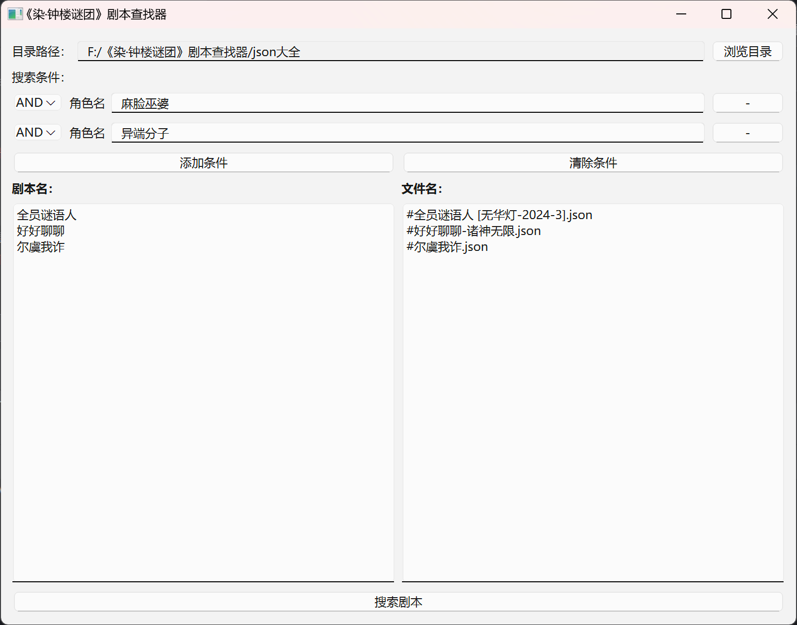

# 剧本查找器 - 《染·钟楼谜团》

这是一个基于 `Tkinter` 的图形用户界面 (GUI) 应用，用于从本地 JSON 文件中查找剧本，并通过给定的角色名称来筛选剧本。本项目允许用户输入角色名称并从指定的目录中搜索包含所有指定角色的剧本。
该项目所有剧本文件均来自[BOTC-json](https://github.com/Zonas-Liu/BOTC-json)的仓库，感谢刘中奇老师和《染·钟楼谜团》官方的工作人员。
## 功能介绍

- **选择目录**：用户可以选择一个包含剧本 JSON 文件的目录。
- **输入角色名称**：用户可以输入多个角色名称，每个角色名称独占一行。
- **剧本查找**：应用会根据用户输入的角色名称，查找包含所有这些角色的剧本。
- **显示结果**：查找到的剧本名称和对应的文件名将分别显示在左右两侧的文本框中。

## 安装与使用

### 1. 克隆仓库
首先，将项目克隆到本地：
```bash
git clone <项目的仓库地址>
```

### 2. 安装依赖
该项目依赖于 Python 以及 `Tkinter`（通常自带在大多数 Python 发行版中）。确保你的 Python 版本支持 Tkinter。如果未安装，请运行以下命令：
```bash
# 对于基于 Debian 的系统
sudo apt-get install python3-tk
```

### 3. 运行项目
使用以下命令来运行程序：
```bash
python 主程序.py
```

## 使用方法

1. **选择剧本目录**：点击 `浏览目录` 按钮，选择包含 JSON 剧本文件的目录。
2. **输入角色名称**：在输入框中输入角色名称，每个角色名称占一行。
3. **点击“搜索剧本”按钮**：程序将从所选目录中的 JSON 文件中搜索包含所有输入角色的剧本。
4. **查看结果**：左侧文本框显示匹配的剧本名称，右侧文本框显示对应的 JSON 文件名。

## 程序截图



## 项目结构

```bash
├── 主程序.py        # 项目的主要程序文件
├── README.md         # 项目的说明文件
└── 其他文件          # 你的 JSON 文件存放目录
```

## 示例

在主程序运行后，用户可以看到一个窗口。选择包含 JSON 剧本的目录后，输入角色名称（例如：`异端分子`），然后点击 `搜索剧本`，结果将显示在下方的左右文本框中。

示例输出：
```
剧本名：                     文件名：
复活庆典 v3.0                #复活庆典-Zets.json
好事多磨                     #好事多磨.json
```

## 依赖

- Python 3.x
- Tkinter

## 贡献

如果你想为本项目做出贡献，请 fork 本项目并提交 Pull Request。

## 许可证

本项目采用 MIT 许可证 - 详细信息请查看 LICENSE 文件。

